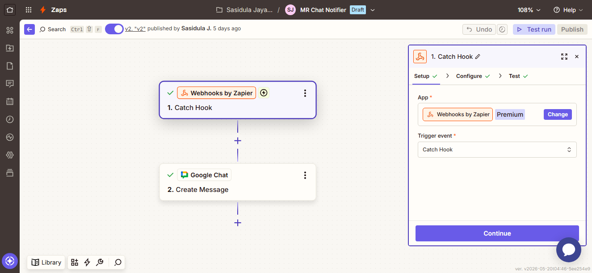
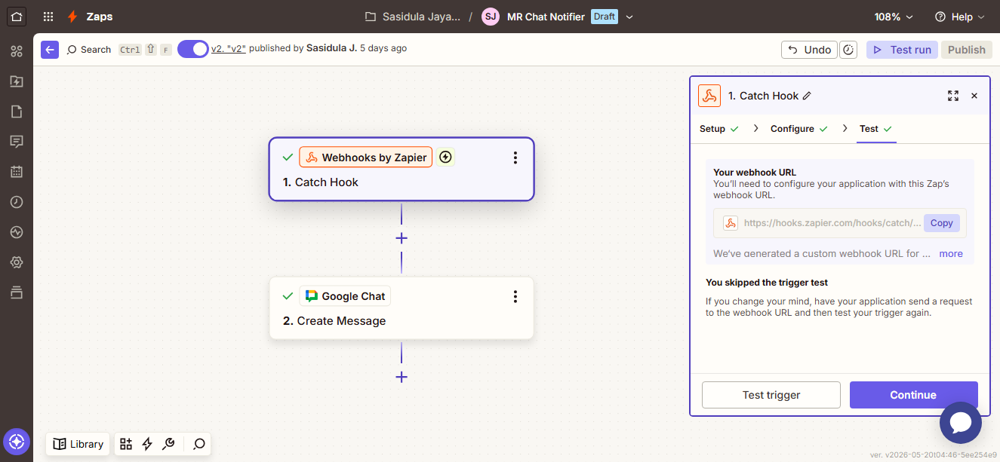
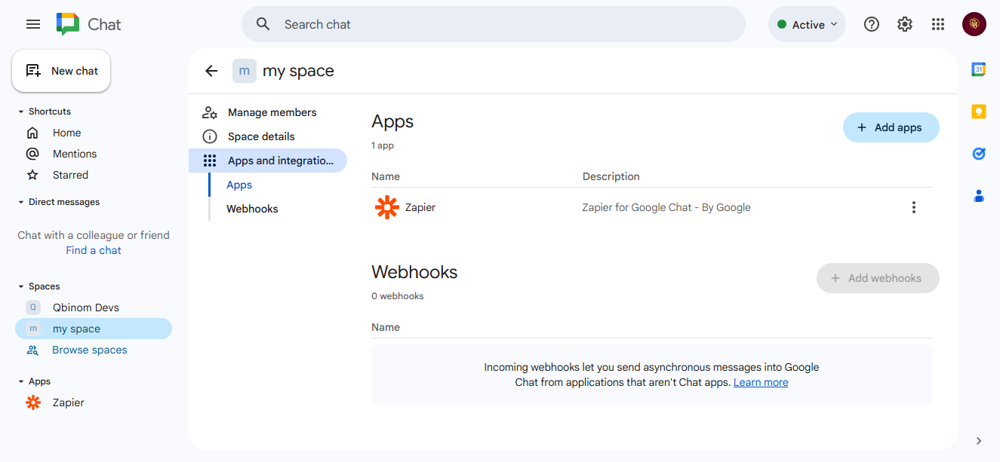
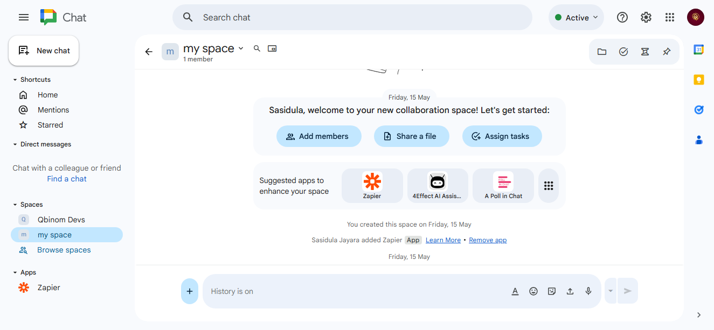
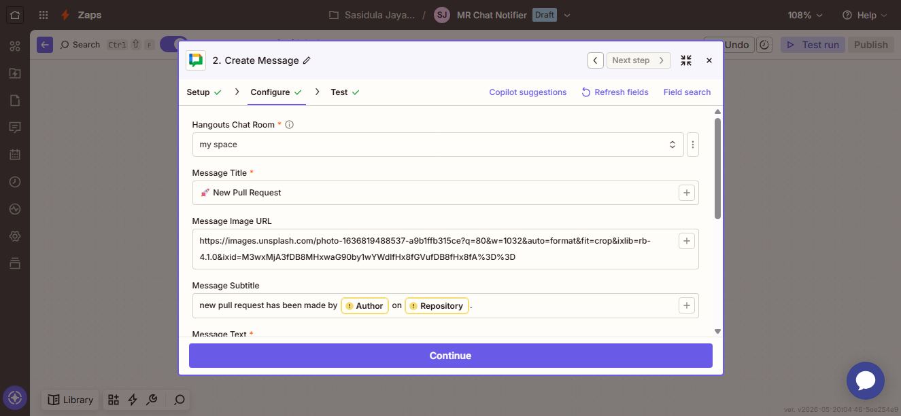
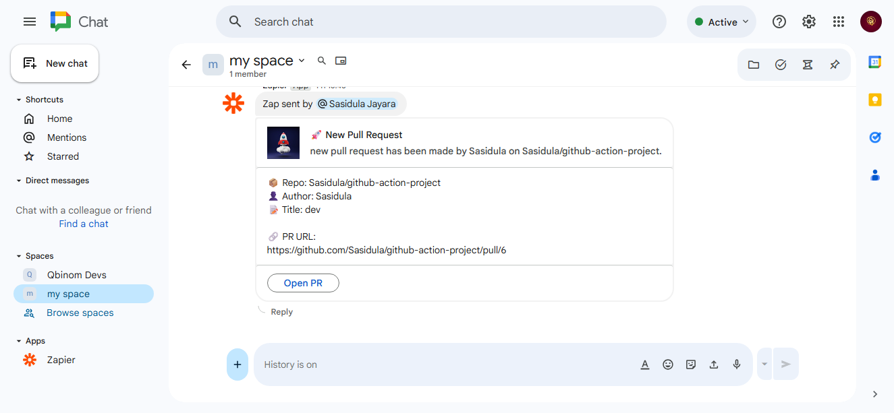
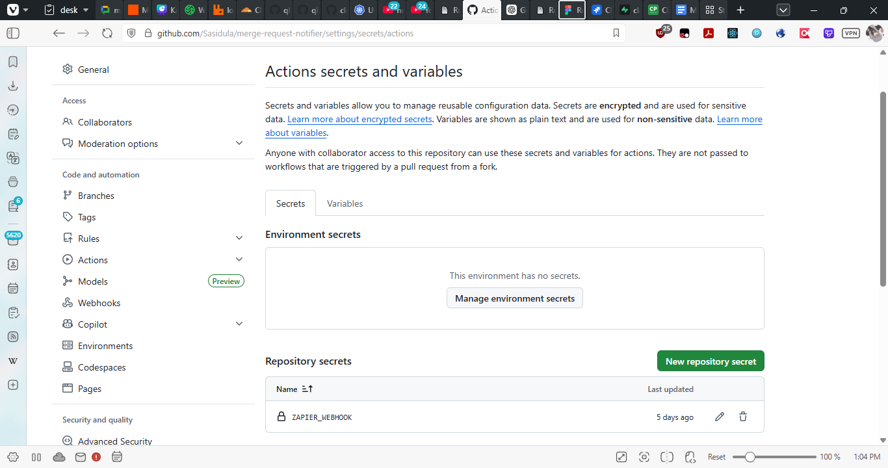
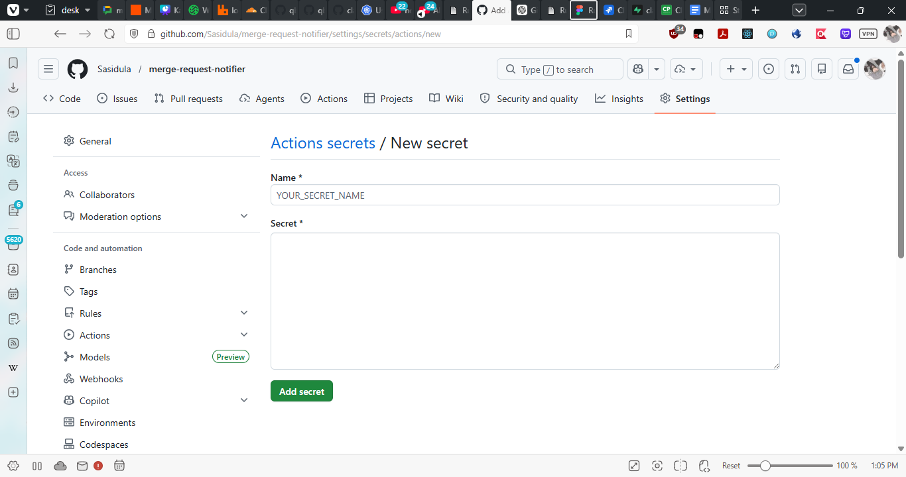
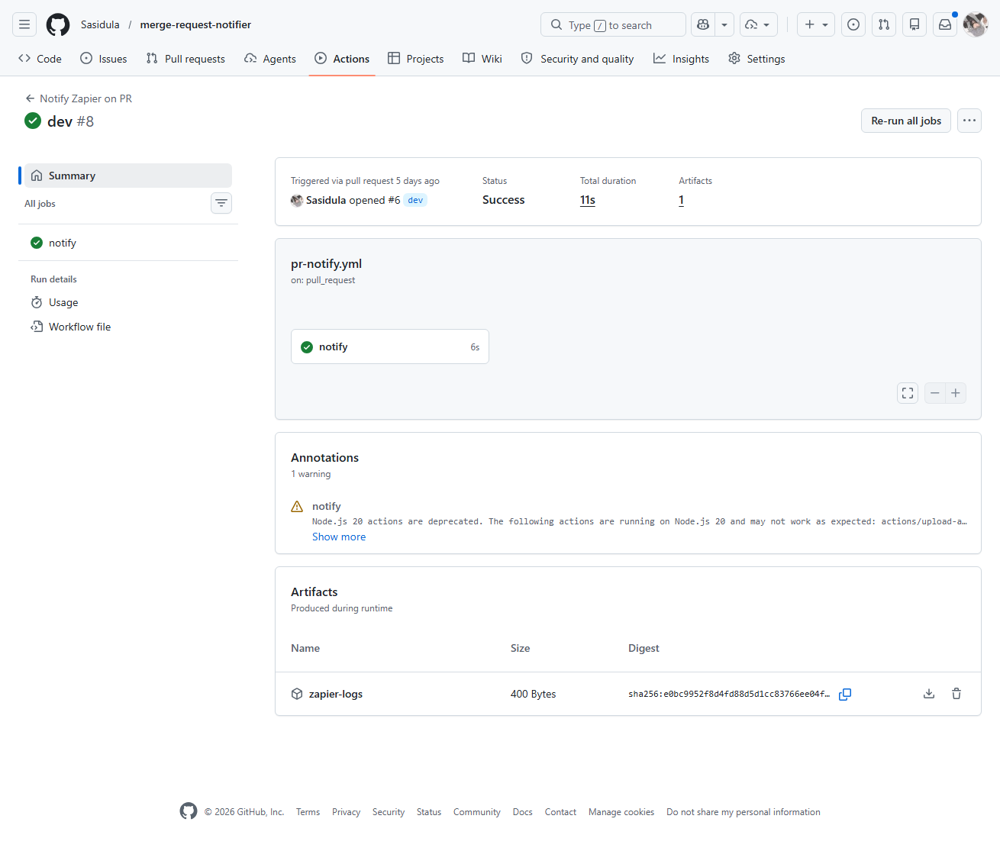

# GitHub PR to Google Chat Notification

Automatically send GitHub pull request updates to Google Chat via Zapier webhooks.

## Architecture

```
GitHub PR Opened
        ↓
GitHub Action
        ↓
Zapier Webhook Catch Hook
        ↓
Google Chat Message
```

---

## Setup Instructions

### Step 1 — Create Zapier Webhook Trigger

In [Zapier](https://zapier.com):

1. Create a new Zap
2. Select **Webhooks by Zapier** as your trigger
3. Choose **Catch Hook** event

  
*Replace with: Screenshot showing Zapier Webhooks by Zapier trigger selection and "Catch Hook" event*

4. Click Continue
5. Zapier generates a webhook URL like:
   ```
   https://hooks.zapier.com/hooks/catch/xxxxx/yyyyy
   ```

  
*Replace with: Screenshot showing the generated webhook URL in Zapier (with the actual URL visible)*

**Copy this URL** — you'll need it in Step 3.

---

### Step 2 — Configure Google Chat Action

Back in Zapier, set up the action:

1. Click **+ Add step**
2. Select **Google Chat** as the action
3. Choose **Send Message** event
4. Connect your Google account

  
*Replace with: Screenshot showing Google Chat action selection in Zapier*

5. Select your Chat Space

  
*Replace with: Screenshot showing the Google Chat space selection dropdown*

6. Configure the message format:

```text
🚀 New Pull Request

📦 Repo: {{repository}}
👤 Author: {{author}}
📝 Title: {{title}}

🔗 Open PR:
{{url}}
```

Map the webhook fields to message placeholders:
- `{{repository}}` ← from webhook `repository`
- `{{author}}` ← from webhook `author`
- `{{title}}` ← from webhook `title`
- `{{url}}` ← from webhook `url`

  
*Replace with: Screenshot showing the message template in Google Chat with field mappings*

7. Save and turn on your Zap

  
*Replace with: Screenshot of the actual Google Chat message that will be sent with all the PR details*

---

### Step 3 — Add Webhook Secret to GitHub

Secure your webhook URL in GitHub:

1. Go to your repository
2. Navigate to **Settings** → **Secrets and variables** → **Actions**
3. Click **New repository secret**

  
*Replace with: Screenshot showing GitHub repository settings → Secrets and variables → Actions*

4. Create a new secret:
   - **Name:** `ZAPIER_WEBHOOK`
   - **Value:** Paste the webhook URL from Step 1

  
*Replace with: Screenshot showing the "New repository secret" form with ZAPIER_WEBHOOK name field*

---

### Step 4 — Create GitHub Action Workflow

Create the workflow file at `.github/workflows/pr-notify.yml`:

```yaml
name: Notify Zapier on PR

on:
  workflow_dispatch:
  pull_request:
    types: [opened]

jobs:
  notify:
    runs-on: ubuntu-latest

    steps:
      - name: Send PR data to Zapier
        run: |
          LOG_FILE=zapier-log.txt

          echo "Starting Zapier notification..." | tee -a $LOG_FILE
          echo "Repository: ${{ github.repository }}" | tee -a $LOG_FILE
          echo "PR Title: ${{ github.event.pull_request.title }}" | tee -a $LOG_FILE
          echo "PR URL: ${{ github.event.pull_request.html_url }}" | tee -a $LOG_FILE
          echo "Author: ${{ github.event.pull_request.user.login }}" | tee -a $LOG_FILE
          echo "PR Number: ${{ github.event.pull_request.number }}" | tee -a $LOG_FILE
          echo "Source Branch: ${{ github.head_ref }}" | tee -a $LOG_FILE
          echo "Target Branch: ${{ github.base_ref }}" | tee -a $LOG_FILE

          RESPONSE=$(curl -s -o response.txt -w "%{http_code}" \
            -X POST "${{ secrets.ZAPIER_WEBHOOK }}" \
            -H "Content-Type: application/json" \
            -d '{
              "repository": "${{ github.repository }}",
              "title": "${{ github.event.pull_request.title }}",
              "url": "${{ github.event.pull_request.html_url }}",
              "author": "${{ github.event.pull_request.user.login }}",
              "pr_number": "${{ github.event.pull_request.number }}",
              "source_branch": "${{ github.head_ref }}",
              "target_branch": "${{ github.base_ref }}"
            }')

          echo "HTTP Status: $RESPONSE" | tee -a $LOG_FILE
          echo "Response Body:" | tee -a $LOG_FILE
          cat response.txt | tee -a $LOG_FILE

          if [ "$RESPONSE" -ge 200 ] && [ "$RESPONSE" -lt 300 ]; then
            echo "Zapier notification sent successfully." | tee -a $LOG_FILE
          else
            echo "Failed to send Zapier notification." | tee -a $LOG_FILE
            exit 1
          fi

      - name: Upload logs
        uses: actions/upload-artifact@v4
        with:
          name: zapier-logs
          path: zapier-log.txt
```

This workflow:
- **Triggers** on new pull requests (`pull_request` with `types: [opened]`)
- **Sends** PR data to your Zapier webhook
- **Logs** all requests and responses
- **Uploads** logs as an artifact for debugging

---

## How It Works

When someone creates a new PR:

1. GitHub Action automatically triggers
2. Action sends PR details to the Zapier webhook URL
3. Zapier receives the data and processes it
4. Google Chat receives and displays the formatted message
5. Team members see the notification instantly

## Testing

### Manual Trigger

You can test the workflow manually:

1. Go to **Actions** tab in GitHub
2. Select **Notify Zapier on PR** workflow
3. Click **Run workflow**
4. Choose your branch and click **Run workflow**

  
*Replace with: Screenshot showing the Actions tab with "Notify Zapier on PR" workflow and Run workflow button*

### View Logs

After running:

1. Click the workflow run
2. Click **Send PR data to Zapier** step
3. Check the output for status and responses

---

## Webhook Payload

The GitHub Action sends this data to Zapier:

```json
{
  "repository": "owner/repo-name",
  "title": "PR Title",
  "url": "https://github.com/owner/repo/pull/123",
  "author": "username",
  "pr_number": 123,
  "source_branch": "feature/branch-name",
  "target_branch": "main"
}
```

---

## Customization

### Add More Notifications

You can expand this for:

- **PR Merged** - Add another workflow for `types: [closed]` with merged status check
- **Review Requested** - Add `pull_request_review_requested` trigger
- **Deployment Finished** - Add workflow dispatch with deployment status
- **CI Failed** - Listen to workflow run failures
- **Jira Ticket Creation** - Add Jira integration in Zapier
- **Slack/Discord** - Replace Google Chat action with Slack/Discord in Zapier

### Modify Message Format

Edit the Google Chat message template in Zapier to include additional fields:

- `PR Number: #{{pr_number}}`
- `Source: {{source_branch}} → Target: {{target_branch}}`
- Add emojis for visual appeal

---

## Troubleshooting

### Webhook Not Receiving Data

1. Check that the `ZAPIER_WEBHOOK` secret is set correctly in GitHub
2. Verify the webhook URL starts with `https://hooks.zapier.com`
3. Check Zapier activity logs for incoming requests

### Message Not Appearing in Google Chat

1. Verify the Zap is turned **ON** in Zapier
2. Check that you have the correct Google Chat space selected
3. Review Zapier logs for error messages
4. Ensure the Google Chat space has the Zapier bot added

### GitHub Action Fails

1. Check the action logs in GitHub
2. Look for curl error messages
3. Verify the webhook URL is accessible (not expired)

---

## Security Notes

⚠️ **Never** share your webhook URL or secrets in:
- Public repositories
- Chat messages
- Debug logs

Always use GitHub Secrets to store sensitive values like webhook URLs.

---

## Requirements

- GitHub repository with Actions enabled
- [Zapier account](https://zapier.com) (free tier works fine)
- Google Chat workspace with a bot-compatible space

---

## File Structure

```
.github/
└── workflows/
    └── pr-notify.yml          # GitHub Action workflow
README.md                       # This file
images/                         # Placeholder folder for screenshots
├── 01-zapier-webhook-setup.png
├── 02-zapier-webhook-url.png
├── 03-google-chat-setup.png
├── 04-select-chat-space.png
├── 05-google-chat-message-template.png
├── 06-google-chat-message-preview.png
├── 07-github-secrets-settings.png
├── 08-github-new-secret.png
└── 09-github-actions-manual-trigger.png
```

---

## License

MIT

---

## Support

For issues or questions:
1. Check the troubleshooting section above
2. Review Zapier and GitHub logs
3. Verify all credentials are correctly set

